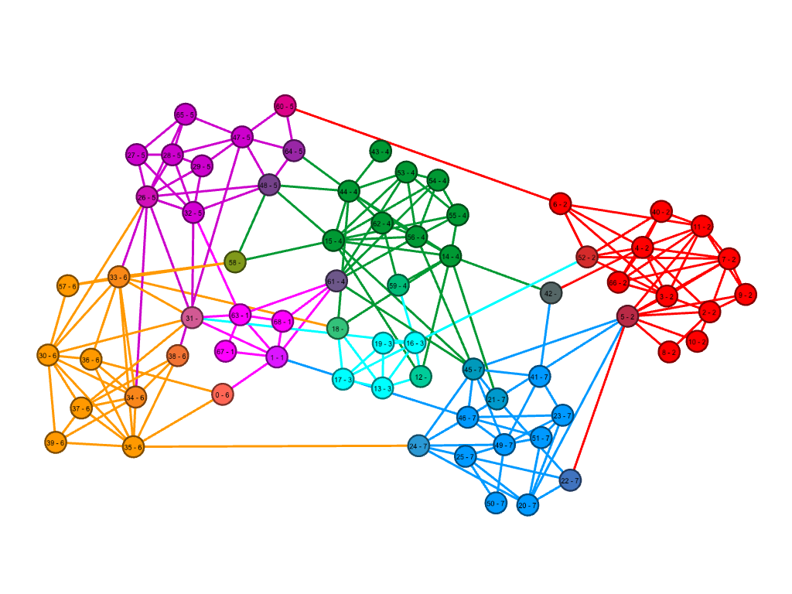
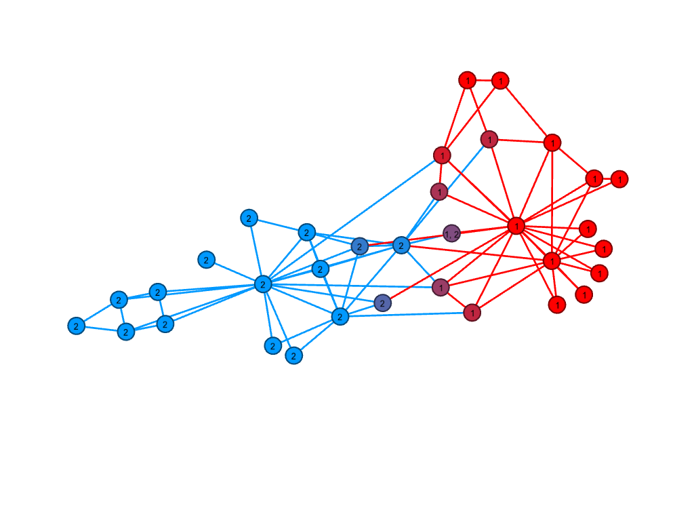
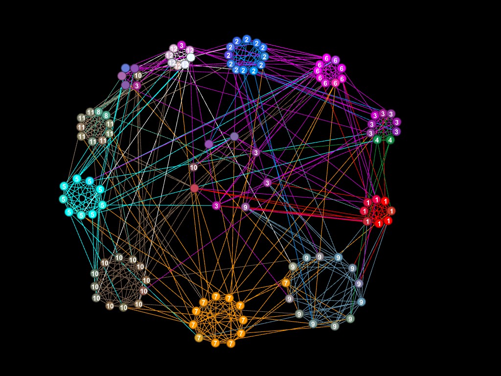

# Link Partitioning Around Medoids (lpam) – Tool for Overlapping Communities Detection in Networks

## What it is? ##

This and java implementation of the method for finding overlapping communities  in network.
Below you can find an example of method output for "School friendship" dataset.




## Project Structure ##
- ./Scripts – directory for all Jupyter notebook that were used for computation experimenst
- ./final_pictures – contains all pictures and gephi files.
- ./lpam – source code of lpam method
- ./datasets – contains realworld datasets and sysntetic datasets 
- ./related_methids – 
- ./literature – papers about overllaping communities detection methods in networks

## Compilation ##
In order to repoduce all computation experiments you should compile all method in the related_methods directory 
and tool for measuring ONMI in the directory Overlapping-NMI. 
Just go to corresponding folder and type "cmake".

```
cd Overlapping-NMI
make
```

To find exact solution for k-medois the installation of [lp_solver](http://lpsolve.sourceforge.net/5.5/) is required.
...TODO

## Contributors ##

* Leonidas Pitsoulis (pitsouli@auth.gr): idea of overlapping communities detection based on the link partitoing with the help of non-overlapping communities detection methods based on the partitioning around medoids
* Marat Shamshetdinov (m.shamshetdinov@gmail.com): Implementation of the exact model for P-Median prolem for lp_solver and cplex solvers.
* Nikit Putehin: implementation of amplified commute distance and heuristics method for findg k-medoids (Clarance and k-meanns heuristics)
* Alexander Ponomarenko (aponom84@gmail.com): Basic implementation of link partitionig algorithm on java, calculating commute distance, jupyter notebooks and collecting everything together

## More Output Examples ##
### Karate Club ###

### American Football Club ###

